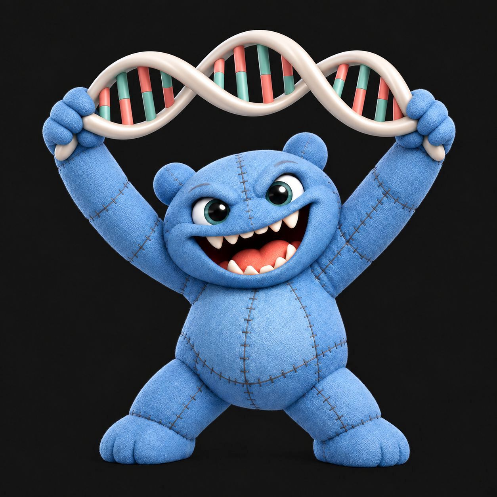
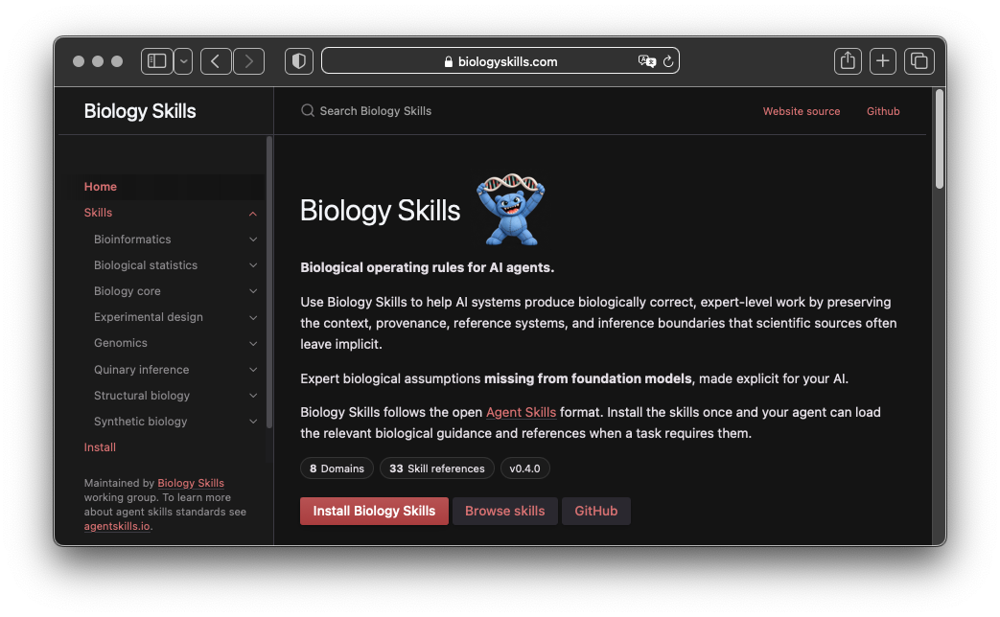
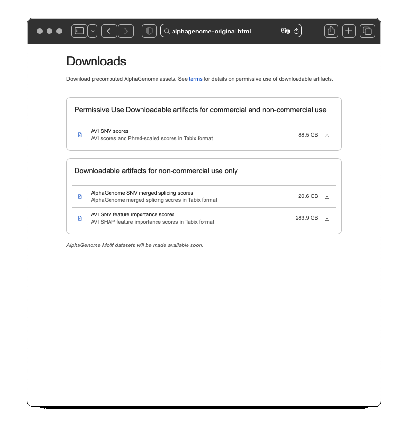

<p align="center">
  
</p>

<h1 align="center">Biology Skills</h1>

<p align="center">
  <strong>Biological operating rules for AI agents.</strong>
</p>

<p align="center">
  Expert biological assumptions that scientific sources leave implicit,
  made explicit for AI-assisted work.
</p>

<p align="center">
  <a href="https://biologyskills.com">
    
  </a>
  <a href="https://github.com/biologyskills/biology-skills/releases">
    
  </a>
  <a href="LICENSE">
    
  </a>
</p>

<p align="center">
  <a href="https://biologyskills.com"><strong>Website</strong></a> ·
  <a href="INSTALL.md"><strong>Install</strong></a> ·
  <a href="https://biologyskills.com/skills/"><strong>Browse skills</strong></a> ·
  <a href="CONTRIBUTING.md"><strong>Contribute</strong></a>
</p>

---

Biology Skills is an open-source collection of concise [Agent Skills](https://agentskills.io/) for biologically correct AI work.

Scientific literature, databases, software, and technical documentation are largely written for experts. Important assumptions are therefore often implicit: the exact reference sequence, whether a negative state was observable, which transcript defines a consequence, what constitutes an independent replicate, or what a model score actually represents.

Biology Skills makes these assumptions operational so an AI agent knows **what it must preserve, verify, or qualify before reaching a conclusion**.

<p align="center">
  
</p>

<p align="center">
  <em>Broad Agent Skills route tasks to focused expert references only when required.</em>
</p>

## Quick start

```bash
git clone https://github.com/biologyskills/biology-skills.git
cd biology-skills
```

Install or expose the relevant directories using the Agent Skills mechanism supported by your AI client.

See [`INSTALL.md`](INSTALL.md) for installation options.

## Example: improving a scientific downloads page

The Google DeepMind AlphaGenome Atlas downloads page provides files for users, but omits key reference, release, and file provenance needed for reproducible use.
If Biology Skills was used, the same downloads page could expose the metadata needed for clearer interpretation and reproducibility.

> [!IMPORTANT]
> The test result shown below shows that if AlphaGenome Atlas used Biology Skills, its downloads page would communicate the same assets with clearer provenance, cleaner metadata structure, and stronger reproducibility cues.

The Biology Skills version ensured: reference and release **metadata**, **explicit** annotation and file **provenance**, structured technical details **without cluttering the interface**.

<p align="center">
  
</p>

## Skill domains

| Domain                                                   | What it protects                                                                                              |
| -------------------------------------------------------- | ------------------------------------------------------------------------------------------------------------- |
| [`biology-core`](skills/biology-core/)                   | Biological context, measurement, observability, evidence, provenance, and valid inference                     |
| [`bioinformatics`](skills/bioinformatics/)               | Computational identity, mappings, metadata, provenance, interoperability, and evidence semantics              |
| [`genomics`](skills/genomics/)                           | Reference systems, sequencing data, variants, transcripts, inheritance, callability, and population frequency |
| [`experimental-design`](skills/experimental-design/)     | Experimental units, replication, dependence, controls, and technical confounding                              |
| [`structural-biology`](skills/structural-biology/)       | Protein and residue identity, isoforms, constructs, structure mappings, and prediction confidence             |
| [`biological-statistics`](skills/biological-statistics/) | Ascertainment, selection, denominators, target populations, dependence, and transportability                  |
| [`synthetic-biology`](skills/synthetic-biology/)         | Patient-specific target identity, peptide:HLA reasoning, target-set selection, and engineered sequence design |
| [`quinary-inference`](skills/quinary-inference/)         | Complete causal explanations, unresolved evidence, competing hypotheses, and posterior support                |

Browse the complete catalogue at **https://biologyskills.com/skills/**.

## What this prevents

A technically plausible answer can still be biologically wrong.

```text
genomic coordinate
    without an exact reference

no variant detected
    without establishing assay scope or callability

protein consequence
    without the transcript used to derive it

residue 117
    without the sequence, isoform, construct, or numbering system

300 measured cells
    treated as 300 independent biological replicates

allele frequency
    without its callable denominator or population context

model rank
    interpreted as a probability

predicted HLA binder
    interpreted as a confirmed immunogenic neoantigen
```

These are not cosmetic metadata problems. They can change the biological conclusion.

> [!IMPORTANT]
> Biology Skills does not replace biological standards, databases, professional guidelines, or primary literature. It makes explicit the expert conditions required to use them correctly in AI-assisted work.

## How it works

Each domain is one installable Agent Skill:

```text
skills/
└── genomics/
    ├── SKILL.md
    └── references/
        ├── reference-genomes.md
        ├── transcripts.md
        ├── variant-representation.md
        └── ...
```

`SKILL.md` contains the cross-cutting rules and AI behaviour needed whenever that domain becomes relevant.

Focused topics live under `references/` and are loaded only when the task requires them.

For example:

```text
question involves a negative genomic result
                ↓
          genomics/SKILL.md
                ↓
assay-scope-callability-and-negative-results.md
```

This keeps agent context compact while still exposing detailed expert guidance when necessary.

## Reference style

Reference pages encode expert stop conditions rather than general textbook knowledge.

A typical page contains:

```text
Summary
Core rules
Required context
AI behaviour
Common failure modes
Authoritative standards
Examples
Sources
```

Examples include:

* [Measurement, observability and negative evidence](skills/biology-core/references/measurement-observability-and-negative-evidence.md)
* [Entity mapping and join cardinality](skills/bioinformatics/references/entity-mapping-and-join-cardinality.md)
* [Assay scope, callability and negative results](skills/genomics/references/assay-scope-callability-and-negative-results.md)
* [Experimental unit, replication and pseudoreplication](skills/experimental-design/references/experimental-unit-replication-and-pseudoreplication.md)
* [Residue identity, isoforms and construct mapping](skills/structural-biology/references/residue-identity-isoforms-and-construct-mapping.md)
* [Ascertainment, selection and target population](skills/biological-statistics/references/ascertainment-selection-and-target-population.md)

The complete reference catalogue is available on the [Biology Skills website](https://biologyskills.com/skills/).

## Design principle

Biology Skills asks:

> **What would an expert refuse to assume before interpreting, comparing, transforming, or calculating from these data?**

Many errors arise when biological meaning is lost across abstraction boundaries:

```text
biological state
      ↓
measurement
      ↓
observed data
      ↓
computational representation
      ↓
analysis
      ↓
biological interpretation
      ↓
causal inference
```

The skills specify what information must survive those transitions.

## What belongs here

Biology Skills focuses on guidance that can materially change scientific correctness:

* distinctions that capable AI systems can plausibly overlook
* minimum context required to interpret a biological object or result
* expert stop conditions that should prevent premature conclusions
* computational transformations that can silently change biological meaning
* explicit AI behaviour for preserving uncertainty and provenance
* links to authoritative standards when exact syntax or nomenclature already has an owner

It is not intended to reproduce general biology textbooks or maintained external standards.

Where an authority exists — including HGVS, GA4GH, VCF, MANE, HGNC, NCBI, IPD-IMGT/HLA, professional guidelines, databases, and primary literature — Biology Skills explains **when the authority matters and what must not be assumed**, then points to the maintained source.

## Validation and export

Canonical content lives under `skills/`.

Repository checks and portable exports are generated from those source files:

```bash
python scripts/validate.py
python scripts/export.py
python -m unittest discover -s tests
```

Generated output is written to `build/` and is not committed.

## Scientific review

Every reference has an explicit review status.

| Status      | Meaning                                                                                          |
| ----------- | ------------------------------------------------------------------------------------------------ |
| `draft`     | Open working content                                                                             |
| `reviewed`  | Reviewed by an appropriate domain expert                                                         |
| `verified`  | Independently reviewed by at least two appropriate experts and supported by relevant evaluations |
| `consensus` | Stable guidance grounded in an established standard or broad expert consensus                    |

The project starts conservatively at `draft`. Status changes occur through public pull requests so the review history remains inspectable.

See [`SOURCE_POLICY.md`](SOURCE_POLICY.md), [`STYLE_GUIDE.md`](STYLE_GUIDE.md), and [`GOVERNANCE.md`](GOVERNANCE.md).

## Contributing

Small, precise contributions are preferred.

Useful contributions include correcting a biological rule, adding a missing expert stop condition, improving an authoritative source, or adding an evaluation for AI behaviour.

See [`CONTRIBUTING.md`](CONTRIBUTING.md).

## Stewardship

Biology Skills is an independent open-source project initiated and maintained by [Switzerland Omics](https://switzerlandomics.ch/).

Scientific contribution, review, and maintainership are open to the wider biology and AI communities.

## Licence

Apache License 2.0. See [`LICENSE`](LICENSE).

